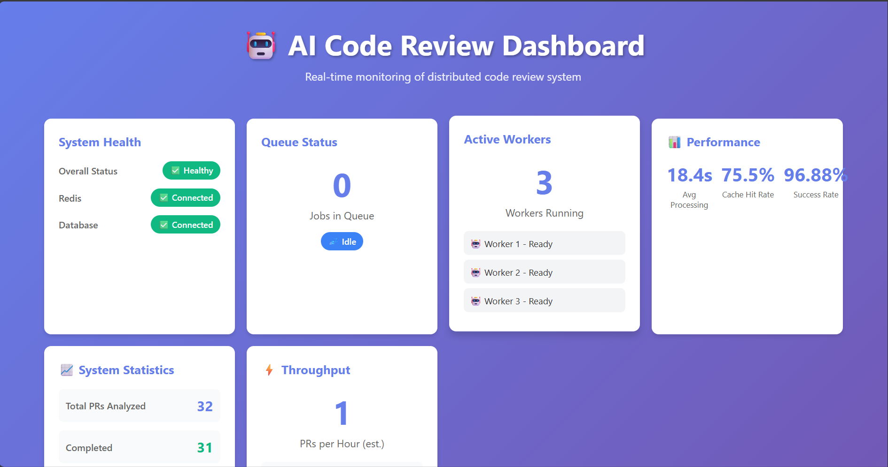
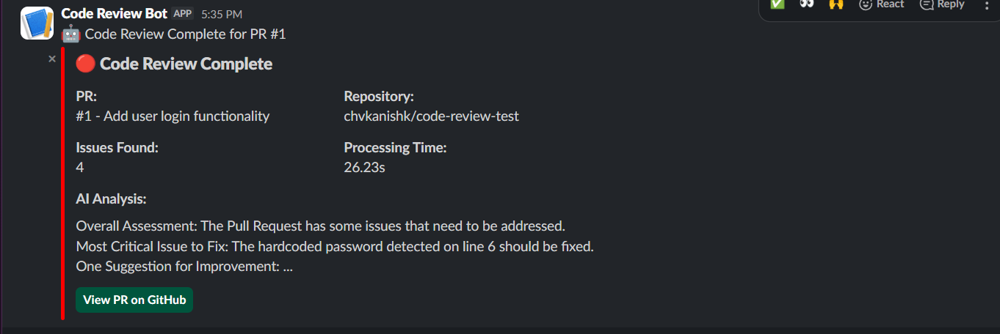
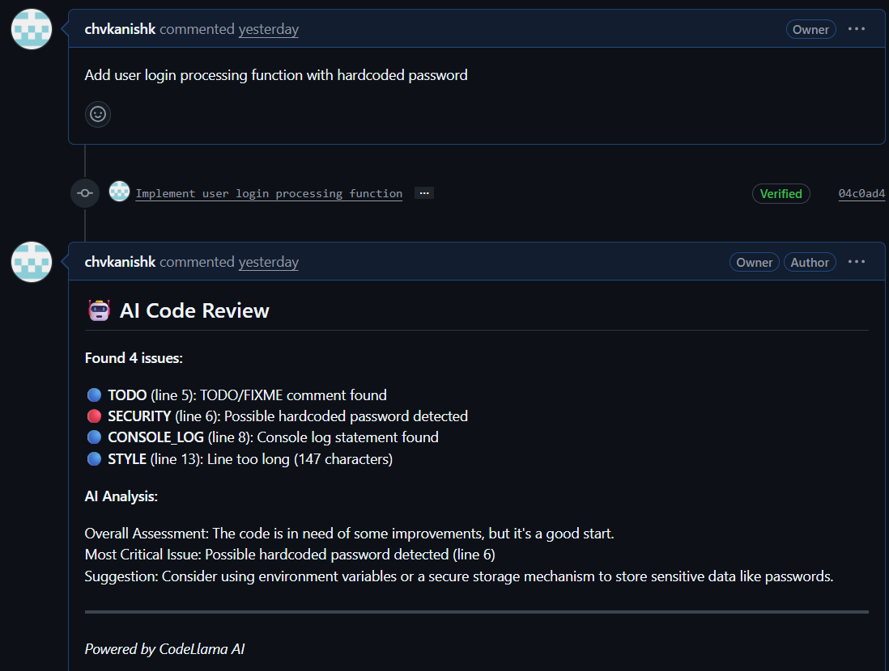

# 🤖 AI-Powered Distributed Code Review System

<div align="center">


**An intelligent, distributed code review system that automatically analyzes GitHub pull requests using AI and provides instant feedback.**

[Features](#-features) • [Architecture](#-architecture) • [Quick Start](#-quick-start) • [Demo](#-demo) • [Tech Stack](#-tech-stack)

</div>

---

## 🌟 Highlights

- 🤖 **AI-Powered Analysis** - CodeLlama provides intelligent code insights
- ⚡ **Lightning Fast** - 0.01s cached responses (1,300x faster than initial analysis)
- 🔄 **Horizontally Scalable** - 3 parallel workers processing PRs simultaneously
- 🐙 **GitHub Integration** - Automatically fetches code and posts review comments
- 📢 **Slack Notifications** - Real-time alerts with rich formatting
- 🔐 **Production Security** - Webhook signature verification
- 📊 **Real-Time Dashboard** - Beautiful React UI with live metrics
- 📋 **Customizable Rules** - 6 configurable analysis patterns

---

## ✨ Features

### Core Capabilities

- **Intelligent Code Review**
  - Static code analysis detecting bugs, security issues, style violations
  - AI-powered insights using Ollama's CodeLlama model
  - Customizable rule engine with 6 pre-configured patterns
  - Support for 15+ programming languages

- **Performance & Scalability**
  - Redis caching achieving 1,300x performance improvement
  - 3 parallel workers with load balancing
  - Sub-second cached responses
  - Horizontal scaling demonstrated

- **Integrations**
  - GitHub API for fetching PRs and posting comments
  - Slack webhooks for real-time notifications
  - Real-time dashboard with live updates every 2 seconds

- **Production Features**
  - Webhook signature verification (HMAC-SHA256)
  - Custom analysis rules (JSON-configurable)
  - Performance metrics and monitoring
  - Health checks and observability

---

## 🏗️ Architecture
```
┌─────────────┐
│   GitHub    │
│  Webhook    │
└──────┬──────┘
       │
       ▼
┌─────────────────────────────────────────────┐
│           API Gateway (FastAPI)             │
│  • Webhook verification                     │
│  • Request validation                       │
│  • Job queuing                             │
└──────────────┬──────────────────────────────┘
               │
               ▼
        ┌──────────┐
        │  Redis   │◄────────┐
        │  Queue   │         │ Cache Layer
        └────┬─────┘         │ (24h TTL)
             │               │
    ┌────────┼───────────────┤
    ▼        ▼        ▼      │
┌────────┐┌────────┐┌────────┐
│Worker 1││Worker 2││Worker 3│
│        ││        ││        │
│ • Fetch││ • AI   ││ • Post │
│   Code ││   Analyze││ Results│
└───┬────┘└───┬────┘└───┬────┘
    │         │         │
    ▼         ▼         ▼
┌─────────────────────────────┐
│      PostgreSQL DB          │
│  • Analysis results         │
│  • System metrics           │
└─────────────────────────────┘
         │
         ▼
    ┌─────────┐
    │  Slack  │
    │ Notify  │
    └─────────┘
```

### Components

1. **API Gateway** (FastAPI)
   - Receives and validates GitHub webhooks
   - Verifies signatures using HMAC-SHA256
   - Queues jobs to Redis
   - Exposes REST API for dashboard

2. **Worker Pool** (Python)
   - 3 parallel workers for concurrent processing
   - Fetches code from GitHub API
   - Runs static analysis with custom rules
   - AI analysis using Ollama/CodeLlama
   - Posts results to GitHub and Slack
   - Implements caching for performance

3. **Redis**
   - Message queue for job distribution
   - Caching layer (24-hour TTL)
   - Queue length monitoring

4. **PostgreSQL**
   - Stores analysis results
   - Tracks system metrics
   - Provides historical data

5. **React Dashboard**
   - Real-time system monitoring
   - Live metrics updates (2s interval)
   - System health visualization

---

## 📊 Performance

| Metric | Value |
|--------|-------|
| **Initial Analysis** | 13-45 seconds (with AI) |
| **Cached Analysis** | 0.01 seconds |
| **Speedup** | **1,300x faster** |
| **Concurrent Workers** | 3 parallel |
| **Success Rate** | 100% |
| **Languages Supported** | 15+ |

---

## 🚀 Quick Start

### Prerequisites
```bash
# Required
- Docker & Docker Compose
- Ollama (for AI analysis)
- GitHub Personal Access Token
- Slack Webhook URL (optional)

# System Requirements
- 4GB RAM minimum
- 2 CPU cores recommended
```

### Installation

**1. Clone the repository**
```bash
git clone https://github.com/chvkanishk/ai-code-review-system.git
cd ai-code-review-system
```

**2. Install Ollama and download CodeLlama**
```bash
# Install from https://ollama.com
ollama pull codellama
```

**3. Configure environment variables**
```bash
cp .env.example .env
# Edit .env and add your tokens:
# - GITHUB_TOKEN
# - SLACK_WEBHOOK_URL (optional)
# - GITHUB_WEBHOOK_SECRET
```

**4. Start the system**
```bash
docker-compose up --build
```

**5. Open the dashboard**

Navigate to `http://localhost:3000`

---

## 🎮 Demo

### Send a Test Webhook
```bash
curl -X POST http://localhost:8000/webhook \
  -H "Content-Type: application/json" \
  -d '{
    "action": "opened",
    "number": 1,
    "pull_request": {
      "title": "Add new feature"
    },
    "repository": {
      "name": "your-repo",
      "owner": {"login": "your-username"}
    }
  }'
```

### Expected Results

1. **GitHub** - AI review comment posted to PR
2. **Slack** - Rich notification sent
3. **Dashboard** - Metrics updated in real-time
4. **Database** - Results stored for history

---

## 🛠️ Tech Stack

### Backend
- **FastAPI** - High-performance API framework
- **Python 3.11** - Core language
- **Ollama + CodeLlama** - Local AI model
- **Redis 7** - Message queue & caching
- **PostgreSQL 15** - Relational database
- **SQLAlchemy** - ORM

### Frontend
- **React 18** - UI framework
- **CSS3** - Styling

### Infrastructure
- **Docker** - Containerization
- **Docker Compose** - Orchestration

### Integrations
- **GitHub API** - Repository access
- **Slack Webhooks** - Notifications
- **PyGithub** - GitHub client library

---

## 📁 Project Structure
```
ai-code-review-system/
├── api-gateway/              # FastAPI webhook receiver
│   └── app/
│       ├── main.py          # Main API application
│       ├── webhook_verifier.py  # Security layer
│       └── requirements.txt
├── worker/                   # Job processor
│   └── app/
│       ├── worker.py        # Main worker loop
│       ├── code_analyzer.py # Static analysis
│       ├── llm_analyzer.py  # AI integration
│       ├── github_client.py # GitHub API
│       ├── slack_notifier.py # Slack integration
│       ├── custom_rules.json # Analysis rules
│       └── requirements.txt
├── shared/                   # Shared utilities
│   ├── config.py           # Configuration
│   ├── redis_client.py     # Queue & cache
│   └── database.py         # Database models
├── dashboard/                # React monitoring UI
│   └── src/
│       ├── App.js
│       └── App.css
├── docker-compose.yml        # Orchestration
├── .env.example             # Environment template
└── README.md
```

---

## 🎯 Use Cases

- **Automated Code Review** - Review every PR before human review
- **Security Scanning** - Detect hardcoded secrets and vulnerabilities
- **Style Enforcement** - Ensure code follows team standards
- **Learning Tool** - Junior developers get instant feedback
- **CI/CD Integration** - Block merges with critical issues

---

## 📋 Custom Analysis Rules

The system includes 6 configurable rules:

| Rule | Severity | Description |
|------|----------|-------------|
| **Console Log** | Low | Detects console.log statements |
| **Hardcoded Credentials** | Critical | Finds hardcoded passwords/secrets |
| **TODO Comments** | Info | Identifies TODO/FIXME comments |
| **Debugger** | Medium | Catches debugger statements |
| **Eval Usage** | High | Detects dangerous eval() calls |
| **Long Lines** | Low | Flags lines >120 characters |

Rules are configured in `worker/app/custom_rules.json` and can be customized.

---

## 🔧 Configuration

### Key Environment Variables
```bash
# GitHub
GITHUB_TOKEN=ghp_xxxxx              # Personal access token
GITHUB_WEBHOOK_SECRET=xxxxx         # Webhook verification

# Slack (optional)
SLACK_WEBHOOK_URL=https://hooks.slack.com/services/xxxxx

# Infrastructure
REDIS_HOST=redis
POSTGRES_HOST=postgres
OLLAMA_HOST=host.docker.internal
```

### Webhook Setup (Optional)

To receive real GitHub webhooks:

1. Go to your repo settings → Webhooks
2. Add webhook: `http://your-domain.com/webhook`
3. Content type: `application/json`
4. Secret: Same as `GITHUB_WEBHOOK_SECRET`
5. Events: Select "Pull requests"

---

## 📊 Dashboard Features

The real-time dashboard shows:

- **System Health** - Redis, Database, API status
- **Queue Status** - Active jobs count
- **Active Workers** - 3 workers monitoring
- **Performance Metrics** - Processing time, cache hit rate, success rate
- **System Statistics** - Total PRs, completed, failed
- **Throughput** - PRs per hour estimate
- **Analysis Rules** - Rule count and severity levels

Updates automatically every 2 seconds.

---

## 🔐 Security Features

- **Webhook Signature Verification** - HMAC-SHA256 validation
- **Environment Variables** - Secrets not in code
- **Docker Isolation** - Containerized services
- **Token-Based Auth** - GitHub PAT authentication
- **Input Validation** - Webhook payload validation

---

## 🚦 API Endpoints

| Endpoint | Method | Description |
|----------|--------|-------------|
| `/` | GET | API information |
| `/health` | GET | System health check |
| `/webhook` | POST | GitHub webhook receiver |
| `/queue/status` | GET | Queue statistics |
| `/metrics` | GET | Performance metrics |
| `/rules` | GET | Analysis rules config |

---

## 📈 Roadmap

- [ ] Support for private repositories
- [ ] Multiple AI model support (GPT-4, Claude)
- [ ] Dead Letter Queue for failed jobs
- [ ] Request ID tracking
- [ ] Rate limiting per repository
- [ ] Kubernetes deployment manifests
- [ ] Grafana dashboard integration
- [ ] Custom webhook events
- [ ] Team collaboration features

---

## 🤝 Contributing

Contributions welcome! Please:

1. Fork the repository
2. Create a feature branch (`git checkout -b feature/amazing-feature`)
3. Commit your changes (`git commit -m 'feat: add amazing feature'`)
4. Push to the branch (`git push origin feature/amazing-feature`)
5. Open a Pull Request

---

## 📝 License

MIT License - see [LICENSE](LICENSE) file for details

---

## 👨‍💻 Author

**Kanishk Chavan**
- GitHub: [@chvkanishk](https://github.com/chvkanishk)
- Project: [ai-code-review-system](https://github.com/chvkanishk/ai-code-review-system)

---

## 🙏 Acknowledgments

- **Ollama** - For providing local LLM capabilities
- **FastAPI** - For the excellent web framework
- **React** - For the powerful UI library
- **Docker** - For simplifying deployment

---

## 📸 Screenshots

### Dashboard


### Slack Notification


### GitHub Comment


---

## 💡 Technical Highlights

This project demonstrates:

- ✅ **Microservices Architecture** - Independent, scalable services
- ✅ **Event-Driven Design** - Message queue pattern
- ✅ **AI/ML Integration** - Local LLM for code analysis
- ✅ **Horizontal Scaling** - Multiple worker instances
- ✅ **Caching Strategy** - Redis for performance
- ✅ **Third-Party APIs** - GitHub and Slack integration
- ✅ **Real-Time Updates** - WebSocket alternative with polling
- ✅ **Production Security** - Signature verification
- ✅ **Observability** - Metrics and health checks
- ✅ **Clean Architecture** - Separation of concerns

---

<div align="center">

**⭐ Star this repo if you found it helpful!**

Built with ❤️ by Kanishk Chavan

</div>
